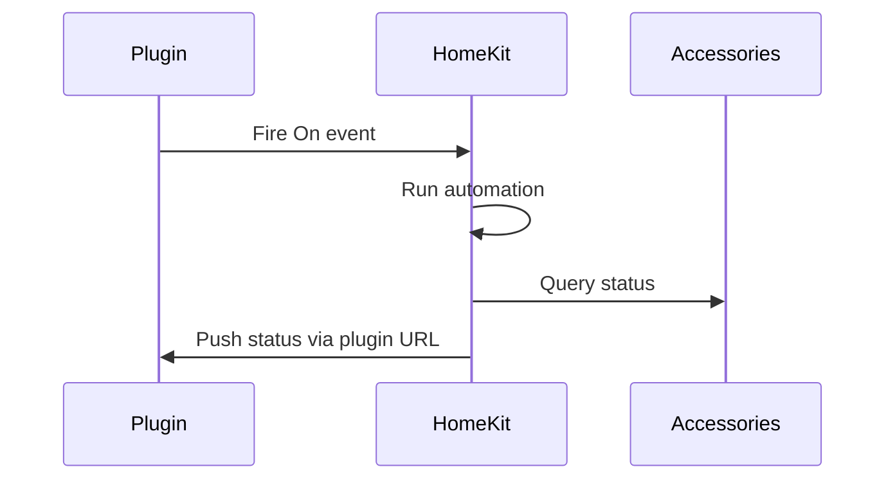

[](https://github.com/hdecarne-github/homekit-telegraf-plugin/releases)
[](https://github.com/hdecarne-github/homekit-telegraf-plugin/actions/workflows/build.yml)
[](https://sonarcloud.io/summary/new_code?id=hdecarne-github_homekit-telegraf-plugin)

## About homekit-telegraf-plugin
This [Telegraf](https://github.com/influxdata/telegraf) input plugin monitors stats of [HomeKit](https://en.wikipedia.org/wiki/HomeKit) accessories. As HomeKit accessories cannot easily queried from outside HomeKit, this plugin uses the following approach:
- The accessories are actually queried by an automation to be created in the [Home app](https://support.apple.com/en-us/HT208940). As mentioned in the linked document, this requires a home hub (HomePod or AppleTV).
- The homekit-telegraf-plugin provides a service URL, which can be invoked by this automation to collect the queried data.
- In addition the homekit-telegraf-plugin creates a virtual switch accessory, which is used to trigger the automation periodically.
The resulting flow is depicted in the following diagram:



### Installation
To install the plugin you have to download a suitable [release archive](https://github.com/hdecarne-github/homekit-telegraf-plugin/releases) and extract it or build it from source by cloning the repository and issueing a simple
```
make
```
To build the plugin, Go version 1.20 or higher is required. The resulting plugin binary will be written to **./build/bin**.
Copy the either extracted or built plugin binary to a location of your choice (e.g. /usr/local/bin/telegraf/).

### Plugin configuration
This is an [external plugin](https://github.com/influxdata/telegraf/blob/master/docs/EXTERNAL_PLUGINS.md) which has to be integrated via Telegraf's [excecd plugin](https://github.com/influxdata/telegraf/tree/master/plugins/inputs/execd).

To use it you have to create a plugin specific config file (e.g. /etc/telegraf/homekit.conf) with following template content:
```toml
[[inputs.homekit]]
  ## The address (host:port) to run the HAP server on
  address = ":8001"
  ## The path to receive monitor requests on
  # monitor_path = "/monitor"
  ## The host names/IPs allowed to send monitor requests (leave empty to allow any host)
  # monitor_hosts = []
  ## The directory path to create for storing the HAP state (e.g. paring state)
  # hap_store_path = ".hap"
  ## The name of the monitor accessory to use for triggering home automation
  # monitor_accessory_name = "Monitor"
  ## The pin to use for pairing the monitor accessory
  # monitor_accessory_pin = 00102003
  ## Celsius temperature value suffixes
  # celsius_suffixes = [" °C"]
  ## Fahrenheit temperature value suffixes
  # fahrenheit_suffixes = [" °F"]
  ## Lux value suffixes
  # lux_suffixes = [" lx"]
  ## Hue value suffixes
  # hue_suffixes = ["°"]
  ## Values representing an active state
  # active_values = ["Yes", "Ja"]
  ## Values representing an inactive state
  # inactive_values = ["No", "Nein"]
  ## Enable debug output
  # debug = false
```
The defaults represent a generally working configuration. Make sure
 - no other service is running on the specified address (**address**).
 - the HAP state directory (**hap_store_path**) is writeable by user executing the plugin.

To enable the plugin within your Telegraf instance, add the following section to your **telegraf.conf**
```toml
[[inputs.execd]]
  command = ["/usr/local/bin/telegraf/homekit-telegraf-plugin", "-config", "/etc/telegraf/homekt.conf", "-poll_interval", "600s"]
  signal = "none"
```

### HomeKit configuration
After restarting Telegraf, the plugin should be up and running. This can be verified by either
- checking whether the virtual switch accessory is available for paring in the Home app or
- checking whether the URL http://<Telegraf host>:<plugin address port>/monitor shows the plugin's version string.
After pairing the virtual switch accessory using the configured pin, accessory states can be monitored as follows:
TODO

### License
This project is subject to the the MIT License.
See [LICENSE](./LICENSE) information for details.