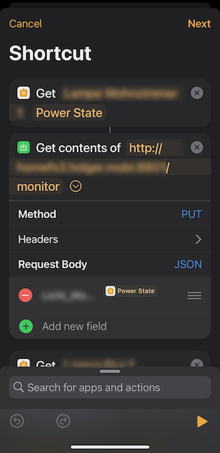
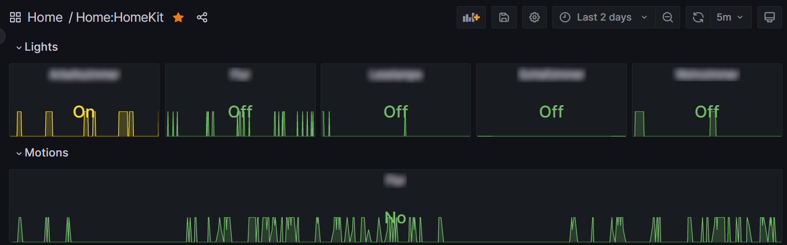

[](https://github.com/hdecarne-github/homekit-telegraf-plugin/releases)
[](https://github.com/hdecarne-github/homekit-telegraf-plugin/actions/workflows/build.yml)
[](https://sonarcloud.io/summary/new_code?id=hdecarne-github_homekit-telegraf-plugin)

## About homekit-telegraf-plugin
This [Telegraf](https://github.com/influxdata/telegraf) input plugin monitors stats of [HomeKit](https://en.wikipedia.org/wiki/HomeKit) accessories. As HomeKit accessories cannot easily queried from outside HomeKit, this plugin uses the following approach:
- The accessories are actually queried by manually configuring a automation in the [Home app](https://support.apple.com/en-us/HT208940). As mentioned in the linked document, this requires a home hub (HomePod or AppleTV).
- The homekit-telegraf-plugin provides a service URL, which can be invoked by this automation to collect the queried data.
- In addition the homekit-telegraf-plugin creates a virtual switch accessory, which is used to trigger the automation periodically.
The resulting flow is depicted in the following diagram:


See the **HomeKit configuration** section below, to understand the not so easy Automation setup on home hub side.

### Installation
To install the plugin you have to download a suitable [release archive](https://github.com/hdecarne-github/homekit-telegraf-plugin/releases) and extract it or build it from source by cloning the repository and issueing a simple
```
make
```
To build the plugin, Go version 1.20 or higher is required. The resulting plugin binary will be written to **./build/bin**.
Copy the either extracted or built plugin binary to a location of your choice (e.g. /usr/local/bin/telegraf/).

### Plugin configuration
This is an [external plugin](https://github.com/influxdata/telegraf/blob/master/docs/EXTERNAL_PLUGINS.md) which has to be integrated via Telegraf's [excecd plugin](https://github.com/influxdata/telegraf/tree/master/plugins/inputs/execd).

To use it you have to create a plugin specific config file (e.g. /etc/telegraf/homekit.conf) with following template content:
```toml
[[inputs.homekit]]
  ## The address (host:port) to run the HAP server on
  address = ":8001"
  ## The path to receive monitor requests on
  # monitor_path = "/monitor"
  ## The host names/IPs allowed to send monitor requests (leave empty to allow any host)
  # monitor_hosts = []
  ## The directory path to create for storing the HAP state (e.g. paring state)
  # hap_store_path = ".hap"
  ## The name of the monitor accessory to use for triggering home automation
  # monitor_accessory_name = "Monitor"
  ## The pin to use for pairing the monitor accessory
  # monitor_accessory_pin = 00102003
  ## Celsius temperature value suffixes
  # celsius_suffixes = [" °C"]
  ## Fahrenheit temperature value suffixes
  # fahrenheit_suffixes = [" °F"]
  ## Lux value suffixes
  # lux_suffixes = [" lx"]
  ## Hue value suffixes
  # hue_suffixes = ["°"]
  ## Values representing an active state
  # active_values = ["Yes", "Ja"]
  ## Values representing an inactive state
  # inactive_values = ["No", "Nein"]
  ## Enable debug output
  # debug = false
```
The defaults represent a generally working configuration. Make sure
 - no other service is running on the configured address (**address**).
 - the HAP state directory (**hap_store_path**) is writeable by the user executing the plugin.
 - as soon as the plugin is running as expected, only the hub is allowed to push data (**monitor_hosts**).

To enable the plugin within your Telegraf instance, add the following section to your **telegraf.conf**
```toml
[[inputs.execd]]
  command = ["/usr/local/bin/telegraf/homekit-telegraf-plugin", "-config", "/etc/telegraf/homekt.conf", "-poll_interval", "600s"]
  signal = "none"
```

### HomeKit configuration
After restarting Telegraf, the plugin should be up and running. This can be verified by either
- checking whether the virtual switch accessory is available for paring in the Home app or
- checking whether the URL http://<Telegraf host>:<plugin address port>/monitor shows the plugin's version information.

After pairing the virtual switch accessory using the configured pin, accessory states can be monitored as follows:

- Open the Home App on your iPhone or iPad (generally any Home App should do, but the one on my Macbook was not able to edit all options).
- Select Add Automation, select the plugin's virtual switch accessory as the automation trigger and its activation as the trigger event.
- As soon as you come to the action screen, choose Convert to Shortcut.
- In the Automation editor remove any pre-added action and for each accessory you want to monitor add two actions.
- The first action for querying the state of the accessory
- and the second action to push this state to the plugin.

For the first action select the Get Home Status action and define the accessory to query as well as the state to query. See section **Mapping of accessory readings to measurements** for which states are supported.
For the second action select the Read URL Content action. The URL to read is the plugin's URL according to your configuration. As Method select PUT and for the Request Body select JSON. Add a text field with the queried accessory state as the value and a name build up as described in section **JSON field name decoding**.



For short lived events like motion detections, the configuration described above may not be sufficent due to its polling based approach.
In such a case the push state action can be configured directly to the event of interest, resulting in an online state update whenever the
event of interest occurs.

### Mapping of accessory readings to measurements
The accessory readings are untyped localized text values. The plugin settings (celsius_suffix, etc.) are used to determine the actual
measurement to record. The following table lists the most common mappings:

| Accessory type | Reading | Measurement | Related setting(s) |
|---|---|---|---|
| Light | Power State | homekit_state | active_values, inactive_values |
| Temperature sensor | Current temperature | homekit_temperature | celsius_suffixes, fahrenheit_suffixes |
| Motion sensor | Motion detected | homekit_state | active_values, inactive_values |
| Light level sensor | Lightning status | homekit_light_level | lux_suffixes |

### JSON field name decoding
The JSON field name for each accesory reading must be build up as follows:

```
<name>[_<room>[_<characteristic>]]
```

The first field **name** denotes the accessory name is mapped to the **homekit_name** tag. The remaining fields are optional. If available the second field **room** is mapped to the **homekit_room** tag and the third field **characteristic** is mapped to the **homekit_characteristic** tag. The characteristic field may be used to differentate unspecific reading like for the homekit_state measurement. The latter may for example contain Light states as well Motion Sensor states. To seperate them into different during reporting graphs, the characteristic tag is a good choice.

For example the field name

```
Light1_Room1_Light
```
will result in a measurement with following tags
```
...,homekit_name=Light1,homekit_room=Room1,homekit_characteristic=Light,...
```

### State measurement (homekit_state)
All boolean states (e.g. Light on/off, Motion detected yes/no) are reported via the **homekit_state** measurement:
```
homekit_state,homekit_characteristic=Light,homekit_monitor=Monitor,homekit_name=Light1,homekit_room=Room1 active=0i 1678629182318409401
```
The state value is reported as 0 (inactive) or 1 (active).


### Temperature measurement (homekit_temperature)
All temperature states are reported via the **homekit_temperature** measurement:
```
homekit_temperature,homekit_characteristic=generic,homekit_monitor=Monitor,homekit_name=Heater1,homekit_room=Room1 celsius=23.5,fahrenheit=74.30000000000001 1678629184212968346
```
Values are always reported in Celsius as well as in Fahrenheit.


### Light Level measurement (homekit_light_level)
All light level states are reported via the **homekit_light_level** measurement:
```
homekit_light_level,homekit_characteristic=generic,homekit_monitor=Monitor,homekit_name=Sensor1,homekit_room=Room1 lux=4 1678629184273480850
```
The light level values are reported in Lux.


### License
This project is subject to the the MIT License.
See [LICENSE](./LICENSE) information for details.